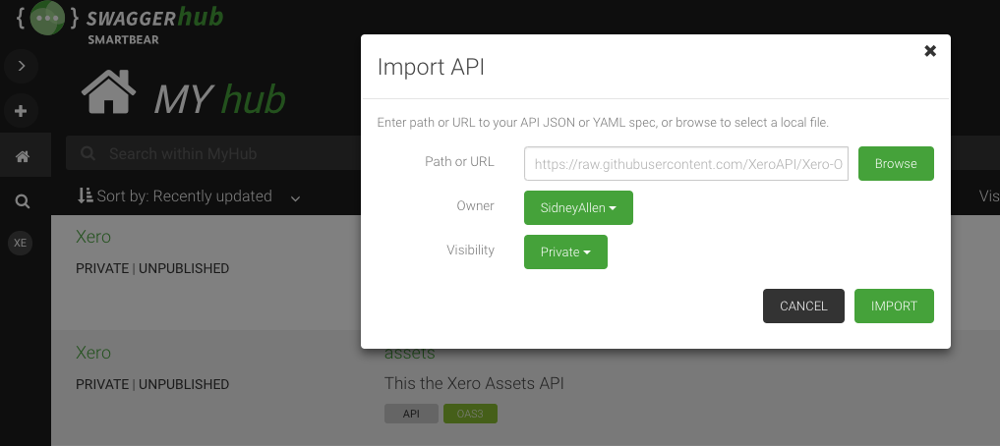

# Xero-OpenAPI
An OpenAPI (Swagger) specification for the Xero API with OAuth 2.0 security schema.

## Description
This repository holds the official Xero [OpenAPI](https://www.openapis.org/) descriptions.   

OpenAPI spec 3.0
In Release (used for one or more SDKs)
* [Accounting](https://raw.githubusercontent.com/XeroAPI/Xero-OpenAPI/master/xero_accounting.yaml)
* [Identity](https://raw.githubusercontent.com/XeroAPI/Xero-OpenAPI/master/xero-identity.yaml)
* [Bank Feeds](https://raw.githubusercontent.com/XeroAPI/Xero-OpenAPI/master/xero_bankfeeds.yaml)
* [Fixed Assets](https://raw.githubusercontent.com/XeroAPI/Xero-OpenAPI/master/xero_assets.yaml)
* [Project](https://raw.githubusercontent.com/XeroAPI/Xero-OpenAPI/master/xero-projects.yaml)
* [Payroll AU](https://raw.githubusercontent.com/XeroAPI/Xero-OpenAPI/master/xero-payroll-au.yaml)
* [Payroll UK](https://raw.githubusercontent.com/XeroAPI/Xero-OpenAPI/master/xero-payroll-uk.yaml)
* [Payroll NZ](https://raw.githubusercontent.com/XeroAPI/Xero-OpenAPI/master/xero-payroll-nz.yaml)
* [Files](https://raw.githubusercontent.com/XeroAPI/Xero-OpenAPI/master/xero_files.yaml)


## Contribution guide

[Conventional commit](https://www.conventionalcommits.org/en/v1.0.0/#summary) format should be used when contributing to this repo.

**Context:**

Release notes are generated using [semantic-release](https://github.com/semantic-release/semantic-release). In brief this package analyses all the commits in the repo to determine the next version number, generate the release notes and publish the package, hence the commit message is important for the release to happen successfully. Please read more on the conventional commit [documentation](https://www.conventionalcommits.org/en/v1.0.0/#summary) before landing your commits, each commit message will determine the release notes.

**Example:**

If your commit message is - ``feat: added a new parameter in the get_account method`` - It will do a **minor version update**. 

Following release notes will be generated -

```
Release notes 

 Feature - 
   - added a new parameter in the get_account method 
```

If your commit message is - ``fix: fixed the null issue with get_invoice method`` - It will do a **patch version update**. 

Following release notes will be generated - 

```
Release notes 

 Fix - 
   - fixed the null issue with get_invoice method
```


if your commit message is as below it will do a **major version update** (Breaking change)

```
chore!: drop support for Node 6

BREAKING CHANGE: use JavaScript features not available in Node 6
```


## Code Generators
We are using [OpenAPI generator](https://github.com/OpenAPITools/openapi-generator) along with these OAS yaml files to generate our new SDKs.

## Preview
### Online
There are lots of tools available for viewing and editing OpenAPI descriptions in a nicely formatted way. A popular tool is SwaggerHub - a version of which is [hosted here](https://app.swaggerhub.com/home). 

Once you sign up or login, you can create a new API under your account and import a Xero API spec.



### Local

#### Node.js
If you have Node.js you can use the Swagger UI via an NPM package (it will open a webpage in your default browser):
`npx -y open-swagger-ui --open ./xero_accounting.yaml`

#### Docker
To view a local file via Docker, run:
`docker run -p 8080:8080 -e SWAGGER_JSON=/local/xero_accounting.yaml -v $PWD:/local docker.swagger.io/swaggerapi/swagger-ui`

To view a hosted file via Docker, run:
`docker run -p 8080:8080 -e SWAGGER_JSON_URL=https://raw.githubusercontent.com/XeroAPI/Xero-OpenAPI/refs/heads/master/xero_accounting.yaml docker.swagger.io/swaggerapi/swagger-ui`


## Updates
If you find something missing or incorrect please [open an issue](https://github.com/XeroAPI/Xero-OpenAPI/issues/new) or send us a pull request.

## API Diff Checking
This repository includes automated API diff checking using [oasdiff](https://github.com/oasdiff/oasdiff) to detect breaking changes and modifications to the OpenAPI specifications.

### Quick Start
```bash
# Check all xero*.yaml files against master branch
./scripts/api-diff/api-diff.sh

# Check a single file
./scripts/api-diff/api-diff.sh xero_accounting.yaml
```

### Branch Naming Convention
Branches containing `breaking` anywhere in the name will allow breaking changes without failing the build. All other branches will fail if breaking changes are detected.

**Examples:** `breaking-api-v2`, `feature-breaking-change`, `api-breaking-update`

### Full Documentation
For detailed usage, configuration options, environment variables, and integration details, see [scripts/api-diff/README.md](scripts/api-diff/README.md).

## License

This software is published under the [MIT License](http://en.wikipedia.org/wiki/MIT_License).

	Copyright (c) 2019 Xero Limited

	Permission is hereby granted, free of charge, to any person
	obtaining a copy of this software and associated documentation
	files (the "Software"), to deal in the Software without
	restriction, including without limitation the rights to use,
	copy, modify, merge, publish, distribute, sublicense, and/or sell
	copies of the Software, and to permit persons to whom the
	Software is furnished to do so, subject to the following
	conditions:

	The above copyright notice and this permission notice shall be
	included in all copies or substantial portions of the Software.

	THE SOFTWARE IS PROVIDED "AS IS", WITHOUT WARRANTY OF ANY KIND,
	EXPRESS OR IMPLIED, INCLUDING BUT NOT LIMITED TO THE WARRANTIES
	OF MERCHANTABILITY, FITNESS FOR A PARTICULAR PURPOSE AND
	NONINFRINGEMENT. IN NO EVENT SHALL THE AUTHORS OR COPYRIGHT
	HOLDERS BE LIABLE FOR ANY CLAIM, DAMAGES OR OTHER LIABILITY,
	WHETHER IN AN ACTION OF CONTRACT, TORT OR OTHERWISE, ARISING
	FROM, OUT OF OR IN CONNECTION WITH THE SOFTWARE OR THE USE OR
	OTHER DEALINGS IN THE SOFTWARE.
