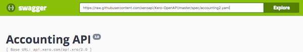
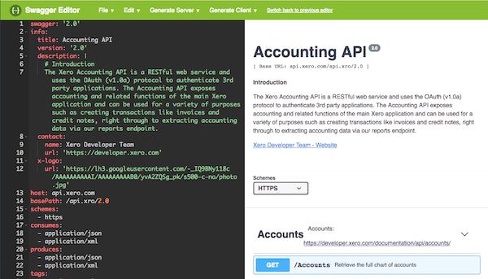

# Xero-OpenAPI
An OpenAPI (Swagger) specification for the Xero API

## Description
This repository holds the official Xero [OpenAPI](https://www.openapis.org/) descriptions. We've started with the Accounting API but we'll work on adding more if they prove useful to the community. 

* [Accounting API - OpenAPI 2.0 - yaml](https://raw.githubusercontent.com/XeroAPI/Xero-OpenAPI/master/spec/accounting2.yaml)
* [Accounting API - OpenAPI 2.0 - json](https://raw.githubusercontent.com/XeroAPI/Xero-OpenAPI/master/spec/accounting2.json)

## Preview
There are lots of tools available for viewing OpenAPI descriptions in a nicely formatted way. A popular tool is Swagger UI - a version of which is [hosted here](http://petstore.swagger.io/). In the URL field just enter the 'raw' URL of the spec file e.g.: `https://raw.githubusercontent.com/XeroAPI/Xero-OpenAPI/master/spec/accounting2.yaml`

## Updates
If you find something missing or incorrect then please [open an issue](https://github.com/XeroAPI/Xero-OpenAPI/issues/new) or send us a pull request. There are lots of tools for editing OpenAPI definitions including the Swagger Editor. Just copy the existing definition into the left-hand window and preview the changes on the right.

## Postman
Postman will automatically import OpenAPI definitions but the OpenAPI spec doesn't support OAuth1.0a. To use our OpenAPI definitions to make requests in Postman you will need to also import the Xero OAuth1a Postman collection from our [Xero-Postman repo](https://github.com/XeroAPI/Xero-Postman).

## Thanks
Thanks very much to @calcinai for contributing the [xero-schemas](https://github.com/calcinai/xero-schemas) from his [xero-php](https://github.com/calcinai/xero-php) project. It was super useful when creating the official definition. Also check out his definitions for [AU Payroll](https://github.com/calcinai/xero-schemas/blob/master/schemas/payroll_au.json), [US Payroll](https://github.com/calcinai/xero-schemas/blob/master/schemas/payroll_us.json), [Assets](https://github.com/calcinai/xero-schemas/blob/master/schemas/assets.json) and [Files](https://github.com/calcinai/xero-schemas/blob/master/schemas/files.json).
