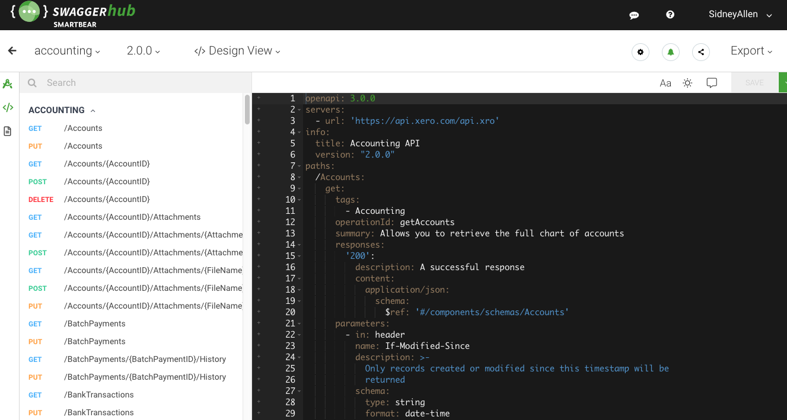
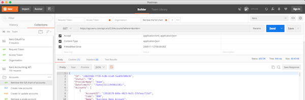

# Xero-OpenAPI
An OpenAPI (Swagger) specification for the Xero API

## Description
This repository holds the official Xero [OpenAPI](https://www.openapis.org/) descriptions.   

OpenAPI spec 3.0
* [Accounting API - yaml](https://raw.githubusercontent.com/XeroAPI/Xero-OpenAPI/master/accounting-yaml/Xero_accounting_2.0.0_swagger.yaml)
* [Accounting API - json](https://raw.githubusercontent.com/XeroAPI/Xero-OpenAPI/master/accounting-json/Xero_accounting_2.0.0_swagger.json)
* [Bank Feeds API - yaml](https://raw.githubusercontent.com/XeroAPI/Xero-OpenAPI/master/bankfeeds-yaml/Xero_bankfeeds_1.0.0_swagger.yaml)
* [Bank Feeds API - json](https://raw.githubusercontent.com/XeroAPI/Xero-OpenAPI/master/bankfeeds-json/Xero_bankfeeds_1.0.0_swagger.json)
* [Fixed Assets API - yaml](https://raw.githubusercontent.com/XeroAPI/Xero-OpenAPI/master/assets-yaml/Xero_assets_1.0.0_swagger.yaml)
* [Fixed Assets API - json](https://raw.githubusercontent.com/XeroAPI/Xero-OpenAPI/master/assets-json/Xero_assets_1.0.0_swagger.json)
* [Files API - yaml](https://raw.githubusercontent.com/XeroAPI/Xero-OpenAPI/master/files-yaml/Xero_files_1.0.0_swagger.yaml)
* [Files API - json](https://raw.githubusercontent.com/XeroAPI/Xero-OpenAPI/master/files-json/Xero_files_1.0.0_swagger.json)

OpenAPI spec 2.0 (Swagger)
* [Accounting API - yaml](https://raw.githubusercontent.com/XeroAPI/Xero-OpenAPI/oas3/spec/v2/accounting2.yaml)
* [Accounting API - json](https://raw.githubusercontent.com/XeroAPI/Xero-OpenAPI/oas3/spec/v2/accounting2.json)

## Preview
There are lots of tools available for viewing and editing OpenAPI descriptions in a nicely formatted way. A popular tool is SwaggerHub - a version of which is [hosted here](https://app.swaggerhub.com/home). 

Once you sign up or login, you can create a new API under your account and import a Xero API spec using the 'raw' URL of the spec file e.g.: `https://raw.githubusercontent.com/XeroAPI/Xero-OpenAPI/oas3/spec/v3/Xero_accounting_2.0.0_swagger.yaml`

## Updates
If you find something missing or incorrect then please [open an issue](https://github.com/XeroAPI/Xero-OpenAPI/issues/new) or send us a pull request. There are lots of tools for editing OpenAPI definitions including the SwaggerHub. Just use the import instructions above.

## Postman
Postman will automatically import OpenAPI definitions but the OpenAPI spec doesn't support OAuth1.0a. To use our OpenAPI definitions to make requests in Postman you will need to also import the Xero OAuth1a Postman collection from our [Xero-Postman repo](https://github.com/XeroAPI/Xero-Postman).

## Thanks
Thanks very much to @calcinai for contributing the original swagger 2.0 version of [xero-schemas](https://github.com/calcinai/xero-schemas) from his [xero-php](https://github.com/calcinai/xero-php) project. It was super useful when creating the official definition. 
